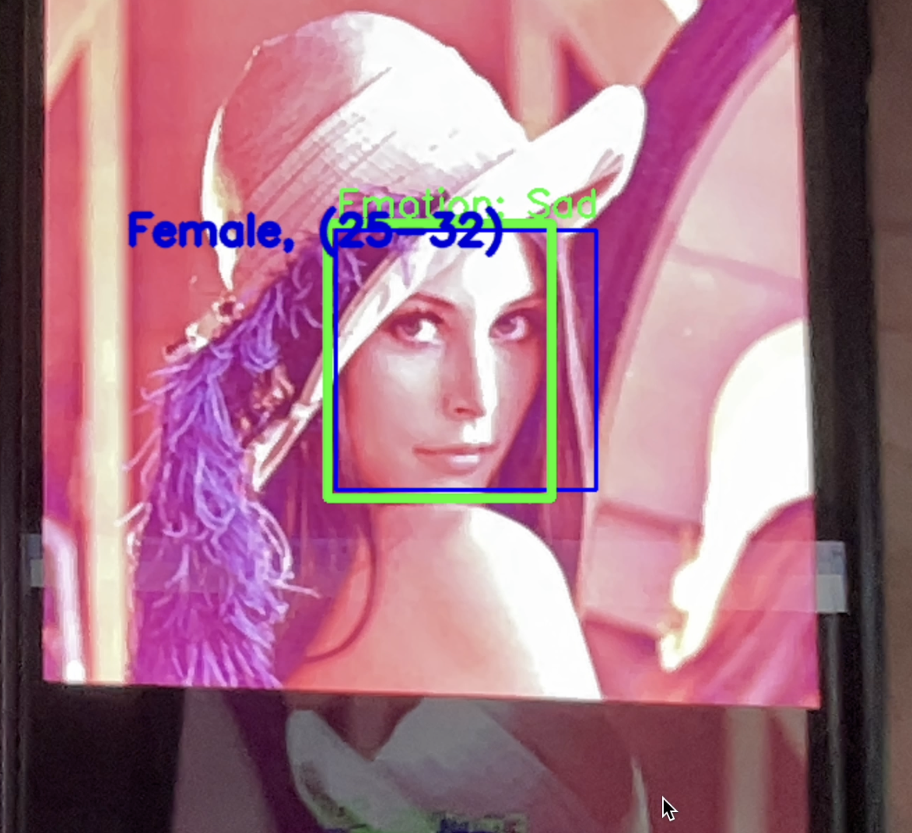

# Live Emotion Detection

This project involves building a Convolutional Neural Network (CNN) for facial emotion recognition using the FER-2013 dataset. The implementation spans two Python scripts, one for creating and training the CNN model and another for integrating the trained model into a webcam interface for real-time emotion detection.

## Training the CNN Model

### Data Preparation
- The FER-2013 dataset is loaded from a CSV file containing pixel values for each image and their corresponding emotion labels.
- The dataset is preprocessed by splitting the data into training and testing sets based on their usage labels.
- Each image is reshaped into a 48x48 pixel grayscale format and augmented using techniques such as rotation, flipping, and shifting.

### Model Architecture
- A deep CNN model is designed with multiple convolutional, batch normalization, and max-pooling layers.
- Dropout layers are added to prevent overfitting, and the final output layer uses a softmax activation function to classify the images into seven emotion categories.

### Training and Evaluation
- The model is compiled using the Adam optimizer and categorical cross-entropy loss function.
- It is trained on the augmented dataset for 120 epochs, with the best model weights saved based on validation loss.
- Training history, including accuracy and loss, is plotted for visualization.
- The model's performance is evaluated on the test set, and a confusion matrix is plotted to illustrate the classification results.

## Real-Time Emotion Detection

### Webcam Integration
- The trained CNN model is loaded for real-time emotion detection using a webcam.
- OpenCV is used to capture video frames from the webcam.
- Each frame is processed to detect faces, which are then resized and passed through the CNN model to predict the emotion.
- The predicted emotion is displayed on the video feed with bounding boxes around detected faces.

### User Interface
- A graphical user interface (GUI) is provided to start and stop the webcam, displaying the live video feed with emotion annotations.
- Users can visualize the real-time emotion detection results directly on their screen.

### Features

- **Age Detection**: Estimates the age of the person.
- **Gender Detection**: Determines if the person is male or female.
- **Emotion Detection**: Recognizes and labels emotions such as Angry, Disgust, Fear, Happy, Sad, Surprise, and Neutral.
- **Spectacle Detection**: Detects if the person is wearing glasses. This is done by creating 2 regions one in the middle of the eyes and the other directly under the eyes.
- **Real-time Webcam Input**: Captures video from the webcam and processes each frame.

### Pre-trained Models

You will need to download the following pre-trained models:
- Emotion detection model (`model.json` and `model.h5`)
- Face detector (`haarcascade_frontalface_default.xml`)
- Facial landmark detector (`shape_predictor_5_face_landmarks.dat`)
- Age and Gender detection models (`opencv_face_detector_uint8.pb`, `opencv_face_detector.pbtxt`, `age_net.caffemodel`, `age_deploy.prototxt`, `gender_net.caffemodel`, `gender_deploy.prototxt`)

Place these models in the appropriate paths as specified in the code.

